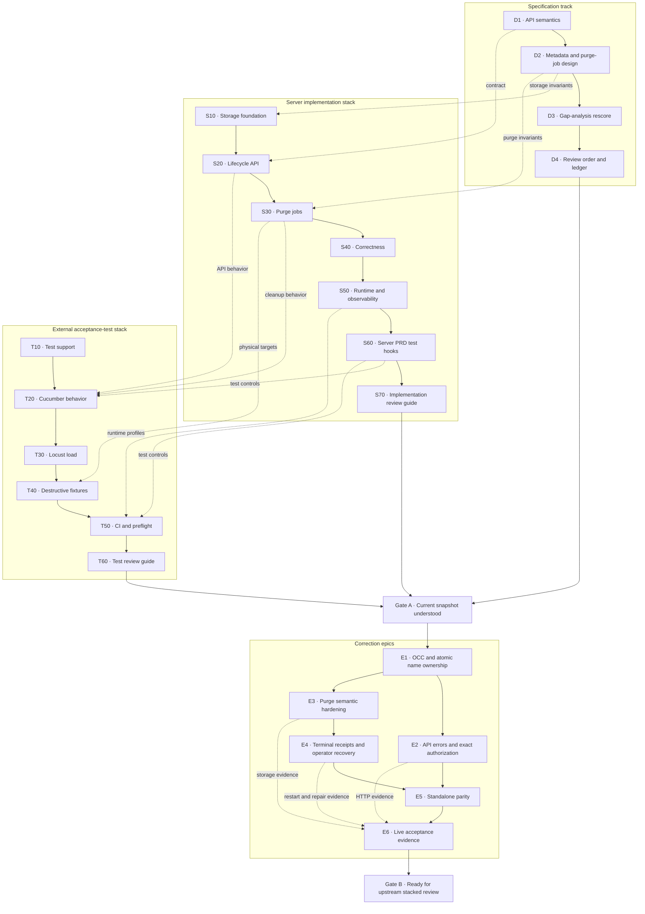

<!--
  Licensed to the Apache Software Foundation (ASF) under one
  or more contributor license agreements.  See the NOTICE file
  distributed with this work for additional information
  regarding copyright ownership.  The ASF licenses this file
  to you under the Apache License, Version 2.0 (the
  "License"); you may not use this file except in compliance
  with the License.  You may obtain a copy of the License at

   http://www.apache.org/licenses/LICENSE-2.0

  Unless required by applicable law or agreed to in writing,
  software distributed under the License is distributed on an
  "AS IS" BASIS, WITHOUT WARRANTIES OR CONDITIONS OF ANY
  KIND, either express or implied.  See the License for the
  specific language governing permissions and limitations
  under the License.
-->

# Iceberg REST Table Deletion Subforest Review Ledger

| Field | Value |
| --- | --- |
| Status | Active review ledger |
| Purpose | Review each bounded implementation subforest and record whether the reviewer agrees |
| Documentation branch | `codex/iceberg-rest-deletion-lifecycle-design` |
| Server umbrella | `codex/iceberg-rest-delete-integration` |
| Test umbrella | `codex/iceberg-rest-delete-tests-integration` |

## Decision vocabulary

Every subforest receives exactly one recorded decision:

| Decision | Meaning |
| --- | --- |
| `NOT REVIEWED` | No implementation agreement has been requested yet |
| `AGREED` | The implementation and exposed contract are acceptable as reviewed |
| `AGREED WITH CHANGES` | The approach is accepted, with a bounded list of required edits |
| `REWORK` | The implementation approach is not accepted and needs a new proposal or branch |
| `DEFERRED` | The unit is intentionally excluded from the current delivery scope |

Reviewing a later subforest does not implicitly approve an earlier one. A dependent subforest may
be explored in parallel, but it cannot be considered accepted until the interfaces it depends on
are either `AGREED` or explicitly frozen for review.

## Review DAG

Solid arrows are branch ancestry. Dotted arrows are cross-stack review dependencies.



## Specification gate

This gate establishes the contract used to judge implementation. It does not approve code.

| Order | Unit | Review question | Initial decision |
| ---: | --- | --- | --- |
| D1 | API semantics | Do DELETE, discovery, UNDROP, retention boundaries, ETags, and HTTP outcomes match the intended user experience? | `NOT REVIEWED` |
| D2 | Metadata design | Do deletion identity, tombstones, Iceberg context, name ownership, audit, and purge jobs express the required invariants without unnecessary machinery? | `NOT REVIEWED` |
| D3 | Gap analysis | After accepted decisions and implementation evidence, which gaps remain blocking, deferred, or resolved? | `NOT REVIEWED` |

## Server implementation subforests

| Order | Branch | Implementation decision to make | Required review evidence | Initial decision |
| ---: | --- | --- | --- | --- |
| S10 | `stack-10-storage` | Agree with the generic `entity_deletion` record, Iceberg context, D1 pointers on the complete table graph, audit records, and exact restore/delete predicates? | Schema diff, mapper predicates, transaction tests, migration/rollback behavior | `NOT REVIEWED` |
| S20 | `stack-20-lifecycle-api` | Agree with one-transaction DELETE and UNDROP, retained Iceberg registration, discovery, ETags, replay, name reservation, and current authorization surface? | Request walkthrough, transaction boundaries, API examples, race table, HTTP tests | `NOT REVIEWED` |
| S30 | `stack-30-purge-jobs` | Agree with bounded batch jobs, action rows as job items, durable target ledgers, lease epochs, restart-safe retries, and exact per-action finalization? | Claim SQL, worker walkthrough, crash boundaries, partial-batch and stale-worker tests | `NOT REVIEWED` |
| S40 | `stack-40-correctness` | Agree that exact-generation authorization, namespace encoding, legacy-GC exclusion, and replay ownership close the intended correctness gaps? | Threat/race review, authorization matrix, generation-reuse tests | `NOT REVIEWED` |
| S50 | `stack-50-runtime-observability` | Agree with scheduler lifecycle, concurrency bounds, retry/backoff, metrics, shutdown, and HA behavior? | Configuration table, operational timeline, metrics list, restart/reclaim tests | `NOT REVIEWED` |
| S60 | `stack-60-prd-tests` | Agree with the server-only test controls and final edge-case behavior exposed to the external suite? | Test-hook security, feature gating, focused server test results | `NOT REVIEWED` |

The S20 snapshot still uses explicit point pre-locks. OCC plus atomic name ownership is already the
accepted correction direction, but the complete S20 subforest remains `NOT REVIEWED` until the
implementation choice and its resulting diff are reviewed.

## External test subforests

| Order | Branch | Implementation decision to make | Required review evidence | Initial decision |
| ---: | --- | --- | --- | --- |
| T10 | `tests-stack-10-support` | Agree with the HTTP, SQL, fixture, and deletion-management adapters used by every higher-level test? | Adapter contracts, isolation rules, unit tests | `NOT REVIEWED` |
| T20 | `tests-stack-20-cucumber` | Agree that the behavior scenarios cover the product matrix and observable API semantics? | PRD-to-scenario traceability and representative reports | `NOT REVIEWED` |
| T30 | `tests-stack-30-load` | Agree with user isolation, workload generation, latency measurement, and 30-concurrent-delete profiles? | Locust model, fixture allocation, dry-run evidence | `NOT REVIEWED` |
| T40 | `tests-stack-40-fixtures` | Agree with the paired database/object snapshot, destructive safety gates, and 6K/50K/500K fixture contract? | Restore/preflight scripts, prefix guards, object verification | `NOT REVIEWED` |
| T50 | `tests-stack-50-ci` | Agree with pre-merge versus scheduled tiers, configuration profiles, artifact capture, and failure handling? | Workflow diff, fork/repository routing, successful CI evidence | `NOT REVIEWED` |

## Correction epics

These are reviewed only after Gate A records what is accepted in the current snapshot.

| Priority | Epic | Decision question | Initial decision |
| ---: | --- | --- | --- |
| E1 | OCC and atomic name ownership | Do point CAS operations and one shared name claim replace pre-locking without weakening parent, generation, or same-name safety? | `NOT REVIEWED` |
| E2 | API and authorization corrections | Are all `404`, `409`, `410`, `412`, and `428` outcomes precise, and can no caller use deletion status as an existence oracle? | `NOT REVIEWED` |
| E3 | Purge semantic hardening | Are registration removal, Iceberg `gc.enabled`, versioned objects, exact targets, and catalog/FileIO drift handled honestly and safely? | `NOT REVIEWED` |
| E4 | Terminal operations | Are receipt retention, audit retention, inspection, redrive, and manual repair safe and adequately authorized? | `NOT REVIEWED` |
| E5 | Standalone parity | Do standalone and auxiliary deployments provide equivalent promised semantics or an explicit supported-scope boundary? | `NOT REVIEWED` |
| E6 | Live acceptance | Do restart, multi-node, medium, and approximately 500,000-object runs prove the accepted invariants? | `NOT REVIEWED` |

## Per-subforest review procedure

For each row above:

1. Show only the incremental diff from its parent branch.
2. Give an implementation tour organized by invariants, not by file count.
3. Show the happy path, concurrency boundary, failure/retry behavior, and external side effects.
4. Run or cite the smallest tests that prove those claims.
5. List correctness blockers separately from nonblocking improvements.
6. Ask the reviewer for one explicit decision from the vocabulary above.
7. Record required changes, owner, follow-up branch, and verification evidence before continuing.

Use this record for every decision:

```text
Subforest:
Reviewed branch and commit:
Decision: NOT REVIEWED | AGREED | AGREED WITH CHANGES | REWORK | DEFERRED
Reviewer:
Date:
Accepted invariants:
Required changes:
Deferred items:
Verification required:
Follow-up branch:
```

No branch should be described as approved merely because it has been pushed, tested locally, or
used as the base of a later branch.
