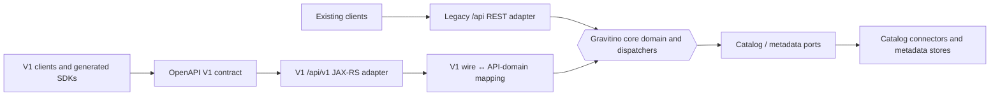

<!--
  Licensed to the Apache Software Foundation (ASF) under one
  or more contributor license agreements.  See the NOTICE file
  distributed with this work for additional information
  regarding copyright ownership.  The ASF licenses this file
  to you under the Apache License, Version 2.0 (the
  "License"); you may not use this file except in compliance
  with the License.  You may obtain a copy of the License at

    http://www.apache.org/licenses/LICENSE-2.0

  Unless required by applicable law or agreed to in writing,
  software distributed under the License is distributed on an
  "AS IS" BASIS, WITHOUT WARRANTIES OR CONDITIONS OF ANY
  KIND, either express or implied.  See the License for the
  specific language governing permissions and limitations
  under the License.
-->

# Gravitino V1 API architecture

The V1 OpenAPI surface is an additional inbound adapter. It does not replace,
reinterpret, or silently route through the existing unversioned `/api` API.
Both surfaces remain independently addressable while V1 grows under its
versioned contract.

The V1 adapter owns public HTTP behavior: strict JSON input, V1 resource and
error representations, conditional request handling, and translation of
internal errors into the documented public error domain. The core and connector
layers retain their internal types and capabilities. A V1 route only exposes a
mutation when the mapping can make its behavior explicit and correct; otherwise
it returns the documented capability error rather than falling back to legacy
behavior.

`openapi.yaml` is the authoritative public contract. It feeds client generation
and contract checks, while the server adapter remains an ordinary JAX-RS
implementation that maps the V1 wire/API-domain model to the existing core.
